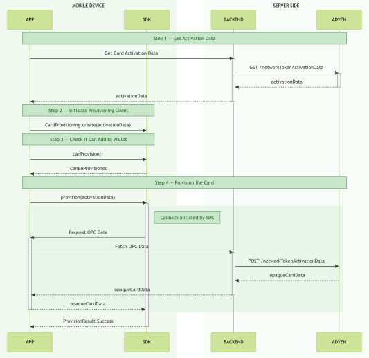

# Adyen Google Wallet Provisioning

Google Wallet In-App Provisioning enables cardholders to add their payment cards to Google Wallet directly from within your app. With this feature, cardholders can quickly and securely add their payment information to their Google Wallet, without having to manually enter their card details.

## Get the Google Push Provisioning API

The Adyen Google Wallet Provisioning SDK has a transitive dependency on the Google Push Provisioning API (version 18.7.0). 

The Google Push Provisioning API is not available publicly but can be provided by Adyen (ask your Adyen Project Operations Manager/Implementation Engineer) or [requested from Google](https://support.google.com/faqs/contact/pp_api_allowlist). 

Once you have the API, the dependency must be made available to your development environment. This can be done via Maven Local by adding the files under your `~/.m2` directory or they can be hosted in an internal Maven repository if you have one. 

**Note:** The Google Push Provisioning API should not be published in such a manner where it is made available publicly.

## Get the Adyen SDK

Adyen Google Wallet Provisioning SDK is available on [GitHub](https://github.com/Adyen/adyen-issuing-android/). Installation instructions can be found there.

### System requirements

Before you start implementing the Adyen SDK, make sure that your system satisfies the following requirements:

- Your application has a `minSdk` version of `21` or higher.
- Your application has a `compileSdk` version of `35` or higher.

### Allowlisting

In order to enable the Google Tap and Pay service, your app will need to be allowlisted with Google. 
Your Adyen Project Operations Manager/Implementation Engineer will do this for you but you will need to provide the following 
information:

- Your app's `applicationId`.
- The SHA-256 fingerprints of your internal app builds.

To find your app's application id, look in your main app module's `build.gradle` file for the value of the `applicationId` property.
To get the SHA-256 fingerprint you can run the `signingReport` gradle command on your main app module, e.g. if your main app module is named `app` then `./gradlew :app:signingReport`. Alternatively, you can use tools such as [apksigner](https://developer.android.com/tools/apksigner)` or [keytool](https://docs.oracle.com/javase/8/docs/technotes/tools/unix/keytool.html) if you prefer.

When you have these values, pass them to your Adyen Project Operations Manager/Implementation Engineer who will request the allowlisting
from Google.

**Note:** Allowlisting will need to be requested for each individual developer machine as each will have its own 
SHA-256 fingerprint.

## In-app provisioning

With Google Wallet in-app provisioning, your cardholder can add their card directly from your app. During the in-app flow, the cardholder taps **Add to Google Wallet** and the provisioning process starts and finishes within your app providing a seamless flow.

The following diagram walks you through the in-app provisioning flow:

1. [Get activation data](#get-activation-data)
2. [Initialize the provisioning client](#initialize-the-provisioning-client)
3. [Check for a card to add to Wallet](#check-for-a-card-to-add-to-wallet)
4. [Provision the card](#provision-the-card)



### Get activation data

Before you start card provisioning, you must get activation data for the specified payment instrument.

1. From your server, make a GET `/paymentInstruments/{id}/networkTokenActivationData` request and specify the `id` of the payment instrument in the path. To make this request, your [API credential](https://docs.adyen.com/issuing/manage-access/api-credentials-web-service) needs the following role:

    - **Bank Issuing PaymentInstrument Network Token Activation Data role**

    ```bash
    curl https://balanceplatform-api-test.adyen.com/bcl/v2/paymentInstruments/{id}/networkTokenActivationData \
    -H 'x-api-key: YOUR_BALANCE_PLATFORM_API_KEY' \
    -H 'content-type: application/json' \
    ```

    The response contains the `sdkInput` object that you need to initialize the provisioning service in the next step.

2. Pass the `sdkInput` to your app.

### Initialize the provisioning client

Initialize the `CardProvisioning` class that is used to check if the cardholder can add a payment card to their Google Wallet.

The `CardProvisioning` instance is initialized by calling the `CardProvisioning.create()` static method. Pass in the `sdkInput` value from step 1 and a function returning an `Activity`. 

```kotlin
fun create(
        sdkInput: String,
        activityProvider: () -> Activity,
    ): CardProvisioningCreateResult
```

Example:
```kotlin
val result = CardProvisioning.create(
    sdkInput,
    { myProvisiioningActivity }
)
val cardProvisioning = when(result) {
    is CardProvisioningCreateResult.Success -> result.cardProvisioning
    is CardProvisioningCreateResult.Failed.GooglePayNotSupported -> throw Exception("Google Pay not supported")
    is CardProvisioningCreateResult.Failed.InvalidSdkInput -> throw Exception("Invalid sdk input")
}
```

The returned `CardProvisioningCreateResult` will provide an instance of `CardProvisioning` if successful or details of the error on failure.

The `CardProvisioning` class provides `suspend` functions which return when the requested operation has either completed or failed and return objects which can be queried for the request state.

### Check for a card to add to Wallet

Call the `canProvision()` method of the `CardProvisioning` instance.

```kotlin
suspend fun canProvision(): CanProvisionResult
```

The value returned by the `canProvision()` method can be used to determine whether the **Add card to Google Wallet** button should be displayed or hidden.

Example:
```kotlin
val result = client.canProvision()
when(result) {
    is CanProvisionResult.CanBeProvisioned -> displayGoogleWalletButton()
    is CanProvisionResult.CannotBeProvisioned.AlreadyExistsInWallet -> hideGoogleWalletButton()
    is CanProvisionResult.CannotBeProvisioned.Error -> throw result.throwable
    is CanProvisionResult.CannotBeProvisioned.UnknownFailure -> throw Exception("Unknown failure")
}
```
**Note:** If you find that the `canProvision()` method returns `CanProvisionResult.CanBeProvisioned` for already provisioned cards then this implies a card configuration issue. 
In this case, please report this issue to your Adyen Project Operations Manager or Implementation Engineer and ask them to verify that the card scheme configuration is correct for your application.

### Provision the card

When the user taps the **Add card to Google Wallet** button the following sequence of operations should be triggered:

1. Call the `provision()` method of the `CardProvisioning` instance, passing in the `cardDisplayName`, `cardAddress` and an `OpcProvider`. This will trigger the Google provisioning flow and the function call will return the result of the provisioning request once the flow has completed.

```kotlin
suspend fun provision(
    cardDisplayName: String,
    cardAddress: CardAddress,
    opcProvider: OpcProvider,
): ProvisionResult
```
**Note:** It is advisable, at the point this call is made, to prevent further provisioning attempts by disabling the **Add card to Google Wallet** button until the provisioning flow completes or is terminated. Processing of rapid taps on the **Add card to Google Wallet** button is likely to result in `InvalidSdkInput` errors.

The `OpcProvider` is a functional interface that you must implement to fetch the Opaque Payment Card (OPC) data from your backend.

```kotlin
fun interface OpcProvider {
    suspend fun fetchOpc(paymentInstrumentId: String, sdkOutput: String): String
}
```

Example:
```kotlin
val opcProvider = OpcProvider { paymentInstrumentId, sdkOutput ->
    // Make a network request to your backend to get the OPC data
    // Your backend should make a POST /paymentInstruments/{id}/networkTokenActivationData request
    // passing the sdkOutput to provision the payment instrument.
    // The response contains the sdkInput (which is the OPC data).
    myBackendService.getOpc(paymentInstrumentId, sdkOutput)
}

val result = client.provision("John Doe", CardAddress(), opcProvider)

when (result) {
    is ProvisionResult.Success -> handleProvisionSuccess(result)
    is ProvisionResult.Failure -> handleProvisionFailure(result)
}
```

## Migrating from SDK versions prior to 0.4.0

In versions of the SDK prior to 0.4.0, the provisioning flow required the client application to manually orchestrate the fetching of the Opaque Payment Card (OPC) data. This involved calling `createSdkOutput()`, sending the result to the backend, receiving the OPC, and then calling `provision()`.

In version 0.4.0 and later, this flow has been simplified. The `createSdkOutput()` method and the `provision(sdkInput, cardDisplayName, cardAddress)` method have been deprecated.

To migrate to the new flow:

1.  Remove the call to `createSdkOutput()`.
2.  Implement the `OpcProvider` interface. This interface encapsulates the logic for fetching the OPC from your backend.
3.  Call the new `provision(cardDisplayName, cardAddress, opcProvider)` method, passing in your `OpcProvider` implementation.

The SDK will now handle the orchestration of fetching the OPC data using your provided `OpcProvider`.

## Troubleshooting

* **Google Tap and Pay dependency not found** - make sure you have the `com.google.android.gms:play-services-tapandpay:18.7.0` dependency correctly hosted using maven local.
* **If you get a 15009 error returned from API calls** then check you have the application id and fingerprint whitelisted with Google.
* **If `canProvision()` returns `CanBeProvisioned` after a card has been provisioned** then is very likely to be due to incorrect card confiuration with the card scheme. Often the problem is the application id has been incorrectly configured.
* **If there is an error message like "Something went wrong, please try again" displayed during the provisioning flow** then this is also likely to be due to card configuration. Validate this by attempting to manually provision the payment instrument. If manual provisioning fails then it is also expected that push provisioning will fail.
