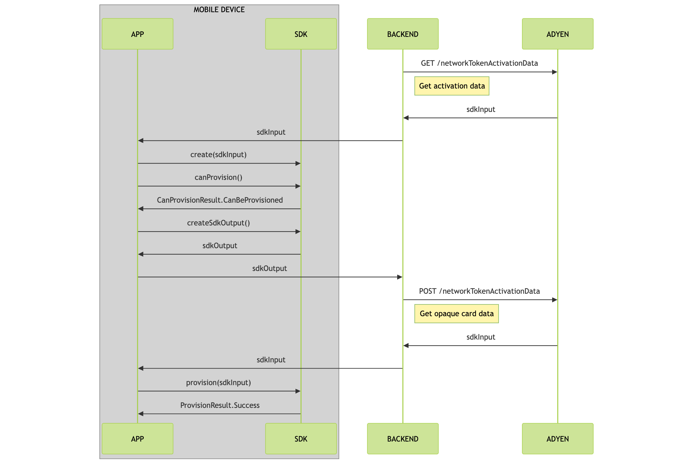

# Adyen Google Wallet Provisioning

Google Wallet In-App Provisioning enables cardholders to add their payment cards to Google Wallet directly from within your app. With this feature, cardholders can quickly and securely add their payment information to their Google Wallet, without having to manually enter their card details.

## Get the Google Push Provisioning API

The Adyen Google Wallet Provisioning SDK has a transitive dependency on the Google Push Provisioning API (version 18.3.3). 

The Google Push Provisioning API is not available publicly but can be provided by Adyen (ask your Adyen account manager) or [requested from Google](https://support.google.com/faqs/contact/pp_api_allowlist). 

Once you have the API, the dependency must be made available to your development environment. This can be done via Maven Local by adding the files under your `~/.m2` directory or they can be hosted in an internal Maven repository if you have one. 

**Note:** The Google Push Provisioning API should not be published in such a manner where it is made available publicly.

## Get the Adyen SDK

Adyen Google Wallet Provisioning SDK is available on [GitHub](https://github.com/Adyen/adyen-google-pay-provisioning-android/). Installation instructions can be found there.

### System requirements

Before you start implementing the Adyen SDK, make sure that your system satisfies the following requirements:

- Your application targets Android 5.0 (API level 21) or later.

## In-app provisioning

With Google Wallet in-app provisioning, your cardholder can add their card directly from your app. During the in-app flow, the cardholder taps **Add to Google Wallet** and the provisioning process starts and finishes within your app providing a seamless flow.

The following diagram walks you through the in-app provisioning flow:

1. [Get activation data](#get-activation-data)
2. [Initialize the provisioning client](#initialize-the-provisioning-client)
3. [Check for a card to add to Wallet](#check-for-a-card-to-add-to-wallet)
4. [Provision the card](#provision-the-card)



### Get activation data

Before you start card provisioning, you must get activation data for the specified payment instrument.

1. From your server, make a GET `/paymentInstruments/{id}/networkTokenActivationData` request and specify the `id` of the payment instrument in the path. To make this request, your [API credential](/issuing/manage-access/api-credentials-web-service) needs the following role:

    - **Bank Issuing PaymentInstrument Network Token Activation Data role**

    ```bash
    curl https://balanceplatform-api-test.adyen.com/bcl/v2/paymentInstruments/{id}/networkTokenActivationData \
    -H 'x-api-key: YOUR_BALANCE_PLATFORM_API_KEY' \
    -H 'content-type: application/json' \
    ```

    The response contains the `sdkInput` object that you need to initialize the provisioning service in the next step.

2. Pass the `sdkInput` to your app.

### Initialize the provisioning client

Initialize the `CardProvisioning` class that is used to check if the cardholder can add a payment card to their Google Wallet.

The `CardProvisioning` instance is initialized by calling the `CardProvisioning.create()` static method. Pass in the `sdkInput` value from step 1, a function returning an `Activity` and, optionally, a request code. 

```kotlin
fun create(
        sdkInput: String,
        activityProvider: () -> Activity,
    ): CardProvisioningCreateResult
```

Example:
```kotlin
val result = CardProvisioning.create(
    sdkInput,
    { myProvisiioningActivity }
)
val cardProvisioning = when(result) {
    is CardProvisioningCreateResult.Success -> result.cardProvsioning
    is CardProvisioningCreateResult.Failed.GooglePayNotSupported -> throw Exception("Google Pay not supported")
    is CardProvisioningCreateResult.Failed.InvalidSdkInput -> throw Exception("Invalid sdk input")
}
```

The returned `CardProvisioningCreateResult` will provide an instance of `CardProvisioning` if successful or details of the error on failure.

The `CardProvisioning` class provides `suspend` functions which return when the requested operation has either completed or failed and return objects which can be queried for the request state.

### Check for a card to add to Wallet

Call the `canProvision()` method of the `CardProvisioning` instance.

```kotlin
suspend fun canProvision(): CanProvisionResult
```

The value returned by the `canProvision()` method can be used to determine whether the **Add card to Google Wallet** button should be displayed or hidden.

Example:
```kotlin
val result = client.canProvision()
when(result) {
    is CanProvisionResult.CanBeProvisioned -> displayGoogleWalletButton()
    is CanProvisionResult.CannotBeProvisioned.AlreadyExistsInWallet -> hideGoogleWalletButton()
    is CanProvisionResult.CannotBeProvisioned.Error -> throw result.throwable
    is CanProvisionResult.CannotBeProvisioned.UnknownFailure -> throw Exception("Unknown failure")
}
```

### Provision the card

When the user taps the **Add card to Google Wallet** button the following sequence of operations should be triggered:

1. Call the `createSdkOutput()` method of the `CardProvisioning` instance to create the `sdkOutput` value.
```kotlin
suspend fun createSdkOutput(): CreateSdkOutputResult
```
2. From your back end, make a POST `paymentInstruments/{id}/networkTokenActivationData` request and pass the `sdkOutput` value to provision the payment instrument. The response contains the `sdkInput` object.
3. Call the `provision()` method of the `CardProvisioning` instance, passing in the `sdkInput` value. This will trigger the Google provisioning flow and the function call will return the result of the provisioning request once the flow has completed. 
```kotlin
suspend fun provision(sdkInput: String, cardDisplayName: String, cardAddress: CardAddress): ProvisionResult
```
Example:
```kotlin
val result = client.provision(sdkInput, "John Doe", CardAddress())
when (result) {
    is ProvisionResult.Success -> handleProvisionSuccess(result)
    is ProvisionResult.Failure -> handleProvisionFailure(result)
}
```
