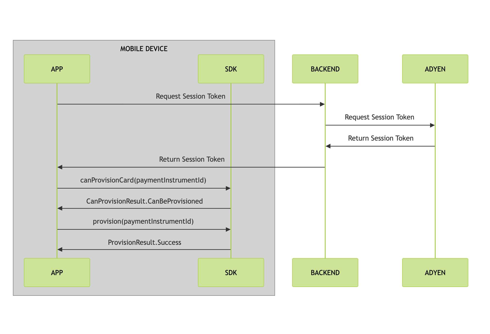
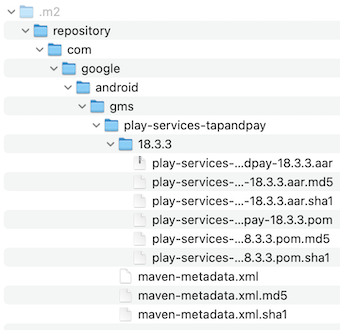

# Provisioning Sessions Android SDK

[![Maven Central][shield.mavenCentral.image]][shield.mavenCentral.link]
[![License][shield.license.image]][shield.license.link]

This guide provides instructions on how to integrate the Provisioning Sessions SDK to add payment 
cards to Google Wallet from your Android application. This is a session-based service that requires 
a session token for each provisioning attempt.

## Table of Contents

- [System Requirements](#system-requirements)
- [Prerequisites](#prerequisites)
  - [Adyen Provisioning Sessions Application Certificate](#adyen-provisioning-sessions-application-certificate)
  - [Google Tap and Pay API Files](#google-tap-and-pay-api-Files)
  - [Allowlisting](#allowlisting)
- [Integration Steps](#integration-steps)
    - [1. Embed the Certificate](#1-embed-the-certificate)
    - [2. Fetch a Session Token](#2-fetch-a-session-token)
    - [3. Add the Provisioning Sessions dependency](#3-add-the-provisioning-sessions-dependency)
    - [4. Initialize the Provisioning Session](#4-initialize-the-provisioning-session)
    - [5. Check the Provisioning State](#5-check-if-a-card-can-be-provisioned)
    - [6. Provision the Card](#6-provision-the-card)
    - [7. Handle the Final State](#7-handle-the-final-state)

## Session-based In-app Provisioning Flow

The Session-based Provisioning SDK differs from using the [Adyen Provisioning SDK](../sdk/docs/README.md) 
in that the backend calls to fetch Card Activation Data and Opaque Card Data are performed 
internally by the Session-based SDK so you do not need to implement this functionality in your backend.

The following diagram walks you through the in-app provisioning flow:


### System Requirements

The SDK requires the following configuration of the host Android application:
- A `minSdk` version of `28` or higher.
- A `compileSdk` version of `35` or higher.

## Prerequisites

Before you begin integrating the SDK you will need to request the following from your Adyen Project Operations Manager/Implementation Engineer:
- An Adyen API Key
- An Adyen Provisioning Sessions Application Certificate
- The Google Tap and Pay API files
- To have your application allowlisted for the Google Tap and Pay API

### Adyen API Key

An Adyen API key allows your backend to authenticate requests to the Adyen API. If your backend already integrates to the Adyen backend then you should already have an API key.

### Adyen Provisioning Sessions Application Certificate

The Adyen Provisioning Sessions Application Certificate is specific to your application and allows 
the SDK to verify the host application. To request the Application Certificate, you will 
need to provide the `applicationId` from your Android application.

To find your app's application id, look in your main app module's `build.gradle` file for the value of the `applicationId` property.

If your app's `applicationId` changes for some reason, then you will need to request a new certificate for the changed `applicationId`.

The certificate will be provided in the form of a file with a `.cer` extension

### Google Tap and Pay API Files

The SDK has a dependency on the Google Tap and Pay API (version 18.3.3). Google does not publish 
this API so you must request it from Adyen and then host it locally. The API files will be provided in
the form of a zip file.

Host the API locally using Maven Local by unzipping the files and adding them under your `~/.m2/repository/` directory. 
The resulting directory structure should resemble the following:
<p style="text-align: center">
  
</p>

After adding the files, make sure you have `mavenLocal()` listed in the `repositories` section of your `settings.gradle` file:

```kotlin
  repositories {
      ...
      mavenLocal()
  }
```
**Note:** Alternatively the Google Tap and Pay API can be hosted in an internal Maven repository if your organization has one.

### Allowlisting

In order to enable the Google Tap and Pay service, your app will need to be allowlisted with Google.
Your Adyen Project Operations Manager/Implementation Engineer will do this for you but you will need to provide the following
information:

- Your app's `applicationId`.
- The SHA-256 fingerprints of your internal app builds.

To find your app's application id, look in your main app module's `build.gradle` file for the value of the `applicationId` property.
To get the SHA-256 fingerprint you can run the `signingReport` gradle command on your main app module, e.g. if your main app module is named `app` then `./gradlew :app:signingReport`. Alternatively, you can use tools such as [apksigner](https://developer.android.com/tools/apksigner)` or [keytool](https://docs.oracle.com/javase/8/docs/technotes/tools/unix/keytool.html) if you prefer.

**Note:** Allowlisting will need to be requested for each individual developer machine as each will have its own
SHA-256 fingerprint. It will also need to be requested for your Google Play build when you publish your app. 
The fingerprint for your Google Play build can be accessed from the Google Play Console.

## Integration Steps

Follow these steps to integrate the Provisioning Sessions SDK into your app.

### 1. Embed the Certificate

First, take the certificate file provided by Adyen and add it to your app module's `res/raw` resource
directory (create a `res/raw` resource directory if you do not already have one). Use code similar 
to the following to load the certificate into an `InputStream`:

```kotlin
// Read the certificate data into an `InputStream` from a raw resource named `app_cert`.
val appCertInputStream = context.resources.openRawResource(R.raw.app_cert)
````

You will use this `InputStream` as part of the SDK initialization in a later step. 

### 2\. Fetch a Session Token

To start a session, your backend needs to fetch a session token from the Adyen API for the specific payment instruments.

From your backend, perform a `POST` request to the following endpoint:

**URL:** `https://test.adyen.com/authe/api/v1/sessions`

**Headers:**

- `Content-Type: application/json`
- `X-API-Key: YOUR_API_KEY`

**Body:**

```json
{
    "allowOrigin": "https://www.adyen.com",
    "product": "platform",
    "policy": {
        "resources": [
            {
                "type": "paymentInstrument",
                "paymentInstrumentId": "PI..."
            }
        ],
        "roles": ["Network Token: Create"]
    }
}
```

Your backend should retrieve the session token when requested by your Android application.

### 3\. Add the Provisioning Sessions dependency

Add the following to the `dependencies` section of the `build.gradle` file of the project module that will use the dependency:

```kotlin
implementation("com.adyen.issuing:provisioning-sessions:0.3.5")
```
Alternatively, add the equivalent [version catalog](https://docs.gradle.org/current/userguide/version_catalogs.html) entry.

### 4\. Initialize the Provisioning Session

With the configuration parameters and token provider ready, you can now create an instance of `ProvisioningSession`.

The SDK interaction is performed through calls to an instance of `ProvisioningSession`. This instance is provided by a static function of the `ProvisioningSession` class:

```kotlin
public fun create(
    appCertInputStream: InputStream,
    paymentInstrumentIds: Set<String>,
    activityProvider: () -> Activity,
    sessionTokenProvider: suspend (Set<String>) -> String,
    environment: ProvisioningEnvironment = ProvisioningEnvironment.LIVE,
): ProvisioningSession
```

Explanation of the `create()` function parameters:
- `appCertInputStream`: The application certificate `InputStream` created in [step 1](#1-embed-the-certificate).
- `paymentInstrumentIds`: The payment instrument ids of the cards that may be provisioned during the session.
- `activityProvider`: A function which returns an `Activity`. The `Activity` returned should be the `Activity` which hosts the card provisioning functionality within the client application.
- `sessionTokenProvider`: A suspend function which returns a session token (see [step 2](#2-fetch-a-session-token)).
- `environment`: An optional parameter which allows selection of a provisioning environment. Default is `ProvisioningEnvironment.LIVE`.`

**Note**: If you prefer, you can use an alternate overload of the `create()` method which allows a 
[ProvisioningSession] to be created using a [java.security.cert.X509Certificate] object rather than
an [InputStream].

Implement a `suspend` function in your app to pass in as the `sessionTokenProvider` parameter. This 
function might look something like the following:

```kotlin
suspend fun fetchSessionTokenFromYourBackend(paymentInstrumentIds: Set<String>): String {
    val body = createSessionTokenRequestBody(paymentInstrumentIds) // See step 2.
    val response = client.post("myBackend/sessionTokenEndpoint", body)
    return if (response.isSuccessful()) {
        response.bodyText()
    } else {
        // If something goes wrong then throw an exception and the SDK will catch it.
        throw Exception("Error fetching session token")
    }
}
```

and then create a `ProvisioningSession` instance, for example:

```kotlin
val provisioningSession = ProvisioningSession.create(
  appCertInputStream = appCertInputStream,
  paymentInstrumentIds = setOf("PI...01", "PI...02"),
  activityProvider = { myProvisioningActivity },
  sessionTokenProvider = { paymentInstrumentIds: Set<String> -> fetchSessionTokenFromYourBackend(paymentInstrumentIds) },
)
```

### 5\. Check if a card can be provisioned

Call the `canProvisionCard` method to check if the given card can be provisioned. 

```kotlin
val result = provisioningSession.canProvisionCard(paymentInstrumentId)

// Based on the 'result', update your UI:
when (result) {
    // Card is ready to be added to wallet.
    is CanProvisionResult.CanBeProvisioned -> showAddToWalletButton()
    // Card has already been added to wallet.
    is CanProvisionResult.CannotBeProvisioned.AlreadyExistsInWallet -> hideAddToWalletButton()
    // The card cannot be added to wallet for some other reason.
    else -> showCannotBeProvisionedReason(result)
}
```

### 6\. Provision the Card

When the user taps the "Add to Google Wallet" button in your app, call the `provisionCard` suspend method. This method will present the native Google Wallet card provisioning flow.

```kotlin
val provisionResult = provisioningSession.provisionCard(
    paymentInstrumentId = paymentInstrumentId,
    cardDisplayName = "John Doe",
    cardAddress = CardAddress()
)
```

**Note:** If you provide an empty `CardAddress`, as above, then the user will be prompted to enter their address during the Google Wallet provisioning flow.

### 7\. Handle the Final State

After the Google Wallet flow is completed (successfully or unsuccessfully), the `provisionCard` method will return a `ProvisionResult`. Use this result to update your UI accordingly:

```kotlin
when (provisionResult) {
    is ProvisionResult.Success -> handleCardProvisioningSuccess(provisionResult.tokenId)
    is ProvisionResult.Failure -> handleCardProvisioningFailure(provisionResult)
}
```

## See also

* [SDK Reference Adyen Google Pay Provisioning](https://adyen.github.io/adyen-issuing-android/0.3.5/AdyenGoogleWalletProvisioning//)
* [Supporting Digital Wallets](https://docs.adyen.com/issuing/digital-wallets/google-wallet-provisioning/)
* [Data security at Adyen](https://docs.adyen.com/development-resources/adyen-data-security)

[shield.mavenCentral.image]: https://img.shields.io/maven-central/v/com.adyen.issuing.provisioning/provisioning-sessions
[shield.mavenCentral.link]: https://mvnrepository.com/artifact/com.adyen.issuing
[shield.license.image]: https://img.shields.io/github/license/Adyen/adyen-issuing-android
[shield.license.link]: ../../LICENSE
